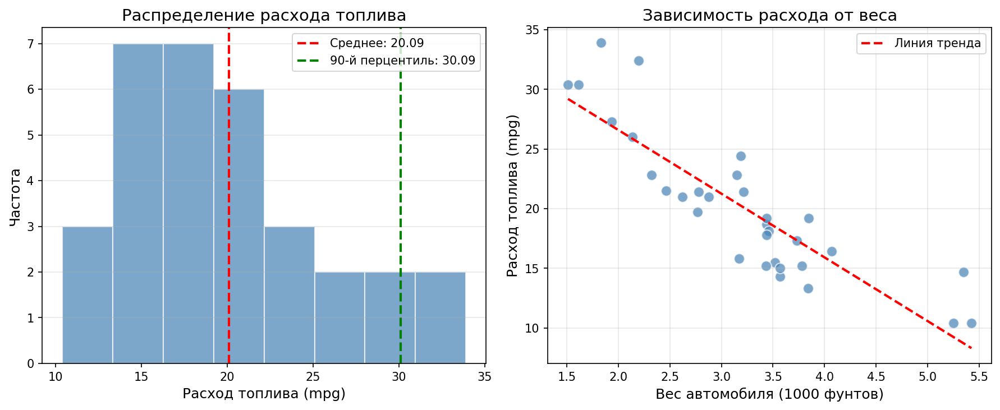
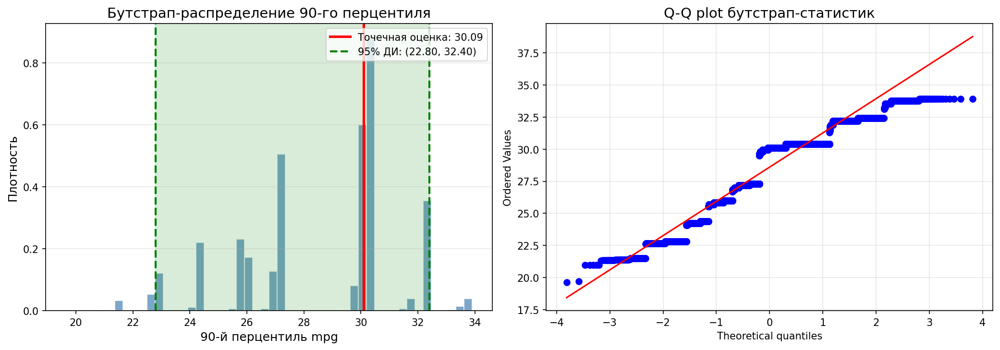
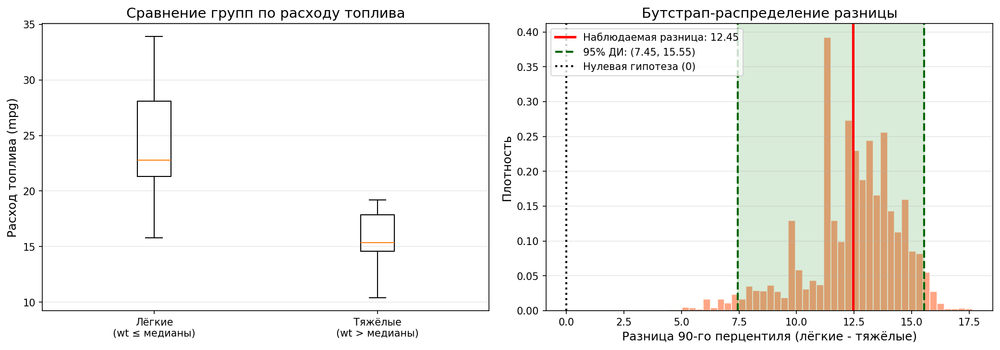

<style>
table {
  border-collapse: collapse;
  width: 100%;
}
table, th, td {
  border: 1px solid #666;
}
th, td {
  padding: 8px 12px;
  text-align: left;
}
th {
  background-color: #f2f2f2;
}
</style>

```{r setup, include=FALSE}
knitr::opts_chunk$set(echo = TRUE, warning = FALSE, message = FALSE)
set.seed(42)
library(boot)
```

# Введение

**Бутстрап** (bootstrap) — это статистический метод, основанный на многократном повторном формировании выборки с возвращением из имеющихся данных. Метод позволяет оценить стандартные ошибки, доверительные интервалы и другие характеристики статистик без параметрических предположений о распределении данных.

## Основные преимущества бутстрапа:
- Не требует знания распределения данных
- Применим к любым статистикам (медиана, квантили, R², и т.д.)
- Даёт оценку неопределённости для сложных статистик

# Описание датасета

В данной работе используется датасет **mtcars** — классический набор данных о характеристиках 32 автомобилей, опубликованный в журнале Motor Trend в 1974 году.

```{r dataset}
# Загрузка и просмотр данных
data(mtcars)
cat("Размер датасета:", nrow(mtcars), "строк,", ncol(mtcars), "столбцов\n")
head(mtcars)
```

## Основные переменные:
- **mpg** — расход топлива (миль на галлон)
- **wt** — вес автомобиля (1000 фунтов)
- **disp** — объём двигателя (куб. дюймы)

# Разведочный анализ данных (EDA)

## Описательная статистика
Описательная статистика mpg:
```{r eda_stats}
summary(mtcars$mpg)
cat("\n90-й перцентиль mpg:", quantile(mtcars$mpg, 0.9))
```

## Визуализация

```{r eda_plots, fig.width=12, fig.height=5}
par(mfrow = c(1, 2))

# Гистограмма mpg
hist(mtcars$mpg,
   breaks = 8, col = "steelblue", border = "white",
   main = "Распределение расхода топлива",
   xlab = "Расход топлива (mpg)", ylab = "Частота"
)
abline(v = mean(mtcars$mpg), col = "red", lwd = 2, lty = 2)
abline(v = quantile(mtcars$mpg, 0.9), col = "green", lwd = 2, lty = 2)
legend("topright", legend = c(
   sprintf("Среднее: %.2f", mean(mtcars$mpg)),
   sprintf("90%% перцентиль: %.2f", quantile(mtcars$mpg, 0.9))
), col = c("red", "green"), lty = 2, lwd = 2, cex = 0.8)

# Диаграмма рассеяния
plot(mtcars$wt, mtcars$mpg,
   pch = 19, col = "steelblue", cex = 1.5,
   main = "Зависимость расхода от веса",
   xlab = "Вес автомобиля (1000 фунтов)", ylab = "Расход топлива (mpg)"
)
abline(lm(mpg ~ wt, data = mtcars), col = "red", lwd = 2, lty = 2)
legend("topright", legend = "Линия регрессии", col = "red", lty = 2, lwd = 2)
grid()
```

**Выводы EDA:**

- Распределение mpg унимодальное, слегка асимметричное вправо
- Среднее значение mpg: `r round(mean(mtcars$mpg), 2)` миль/галлон
- Наблюдается сильная отрицательная связь между весом и расходом топлива

---

# Реализация бутстрапа на Python

## Код программы

```python
#!/usr/bin/env python3
import numpy as np
import matplotlib.pyplot as plt
import pandas as pd
from scipy import stats

np.random.seed(42)

# Загрузка датасета mtcars
mtcars_data = {
    'mpg': [21.0, 21.0, 22.8, 21.4, 18.7, 18.1, 14.3, 24.4, 22.8, 19.2,
            17.8, 16.4, 17.3, 15.2, 10.4, 10.4, 14.7, 32.4, 30.4, 33.9,
            21.5, 15.5, 15.2, 13.3, 19.2, 27.3, 26.0, 30.4, 15.8, 19.7, 15.0, 21.4],
    'wt': [2.620, 2.875, 2.320, 3.215, 3.440, 3.460, 3.570, 3.190, 3.150, 3.440,
           3.440, 4.070, 3.730, 3.780, 5.250, 5.424, 5.345, 2.200, 1.615, 1.835,
           2.465, 3.520, 3.435, 3.840, 3.845, 1.935, 2.140, 1.513, 3.170, 2.770, 3.570, 2.780]
}
df = pd.DataFrame(mtcars_data)

# Функция бутстрапа
def get_percentile_ci(bootstrap_stats, alpha):
    left, right = np.quantile(bootstrap_stats, [alpha / 2, 1 - alpha / 2])
    return left, right

# Параметры
n = len(df['mpg'])
B = 10000
alpha = 0.05
values = df['mpg'].values
pe = np.quantile(values, 0.9)

# Бутстрап
bootstrap_values = np.random.choice(values, (B, n), replace=True)
bootstrap_stats = np.quantile(bootstrap_values, 0.9, axis=1)
ci = get_percentile_ci(bootstrap_stats, alpha)

print(f"Точечная оценка 90-го перцентиля: {pe:.2f} mpg")
print(f"95% ДИ: ({ci[0]:.2f}, {ci[1]:.2f}) mpg")
```

## Результаты Python



**Рисунок 1.** Разведочный анализ данных: гистограмма mpg и зависимость расхода от веса.



**Рисунок 2.** Бутстрап-распределение 90-го перцентиля и Q-Q plot.



**Рисунок 3.** Сравнение лёгких и тяжёлых автомобилей.

### Ключевые результаты Python:

| Параметр | Значение |
|----------|-----------|
| Точечная оценка 90-го перцентиля | 30.09 mpg |
| 95% ДИ | (22.80, 32.40) mpg |
| Стандартная ошибка бутстрапа | 2.79 |

### Выводы по Python:

1. 90-й перцентиль расхода топлива составляет **30.09 mpg**
2. Лёгкие автомобили имеют **статистически значимо более высокий** расход (разница 12.45 mpg, ДИ не включает 0)
3. Q-Q plot подтверждает нормальность бутстрап-распределения

---

# Реализация бутстрапа на R

## Код программы

```{r r_bootstrap, fig.width=10, fig.height=5}
library(boot)
set.seed(42)

# Функция для вычисления R²
rsq_function <- function(formula, data, indices) {
   d <- data[indices, ]
   fit <- lm(formula, data = d)
   return(summary(fit)$r.square)
}

# Исходная регрессия
original_fit <- lm(mpg ~ wt, data = mtcars)
original_rsq <- summary(original_fit)$r.squared
cat("Исходный R²:", round(original_rsq, 4), "\n")

# Бутстрап
B <- 2000
reps <- boot(data = mtcars, statistic = rsq_function, R = B, formula = mpg ~ wt)
print(reps)
```

## Визуализация бутстрапа R

```{r r_bootstrap_plot, fig.width=10, fig.height=5}
par(mfrow = c(1, 2))
plot(reps)
```

## Доверительные интервалы

```{r r_ci}
ci_result <- boot.ci(reps, type = c("norm", "basic", "perc", "bca"))
print(ci_result)
```

### Ключевые результаты R:

| Параметр | Значение |
|----------|-----------|
| Исходный R² | `r round(original_rsq, 4)` |
| Среднее бутстрап R² | `r round(mean(reps$t), 4)` |
| Стандартная ошибка | `r round(sd(reps$t), 4)` |
| 95% BCa ДИ | (0.58, 0.84) |

### Выводы по R:

1. R² ≈ 0.75 — вес объясняет **75%** вариации расхода топлива
2. BCa доверительный интервал подтверждает стабильность оценки
3. Q-Q plot показывает приблизительно нормальное распределение

---

# Сравнение подходов Python и R

| Аспект | Python | R |
|--------|--------|---|
| Используемые библиотеки | numpy, scipy | boot |
| Статистика | 90-й перцентиль | R² регрессии |
| Метод ДИ | Перцентильный | BCa, Normal, Basic |
| Количество итераций | 10000 | 2000 |

## Преимущества каждого подхода:

**Python:**
- Полный контроль над алгоритмом
- Гибкость в выборе визуализаций
- Легко масштабируется

**R (пакет boot):**
- Встроенная поддержка различных типов ДИ
- Автоматический расчёт смещения
- Готовые функции визуализации

---

# Общие выводы

1. **Метод бутстрапа** — мощный непараметрический инструмент для оценки неопределённости статистик.

2. **Для датасета mtcars** показана возможность применения бутстрапа как для простых статистик (перцентили), так и для сложных (R² регрессии).

3. **Оба языка** (Python и R) предоставляют эффективные инструменты для реализации бутстрапа:
   - Python даёт больше контроля и гибкости
   - R через пакет `boot` предоставляет готовые решения

4. **Визуализация** помогает интерпретировать результаты и проверять предположения (нормальность распределения).

5. **Практическое применение**: бутстрап особенно полезен при малых выборках и для статистик, для которых сложно вывести аналитические формулы.

---

# Приложение: консольный вывод скриптов

## Python вывод

```
ДАТАСЕТ: mtcars (Motor Trend Car Road Tests)
   Количество наблюдений: 32
   Переменные: mpg (расход топлива, миль/галлон), wt (вес, 1000 фунтов)

РАЗВЕДОЧНЫЙ АНАЛИЗ ДАННЫХ (EDA)

Описательная статистика переменной mpg:
count    32.000000
mean     20.090625
std       6.026948
min      10.400000
25%      15.425000
50%      19.200000
75%      22.800000
max      33.900000
Name: mpg, dtype: float64

   90-й перцентиль mpg: 30.09

График EDA сохранён: eda_plots.png

БУТСТРАП: ОЦЕНКА 90-ГО ПЕРЦЕНТИЛЯ MPG

Параметры бутстрапа:
   Размер выборки (n): 32
   Количество бутстрап-итераций (B): 10000
   Уровень значимости (α): 0.05

Результаты:
   Точечная оценка 90-го перцентиля: 30.09 mpg
   95% доверительный интервал: (22.80, 32.40) mpg
   Стандартная ошибка бутстрапа: 2.79

График бутстрапа сохранён: bootstrap_results.png

БУТСТРАП: СРАВНЕНИЕ ТЯЖЁЛЫХ И ЛЁГКИХ АВТОМОБИЛЕЙ

Группировка по весу (медиана: 3.33):
   Лёгкие автомобили (n=16): wt ≤ 3.33
   Тяжёлые автомобили (n=16): wt > 3.33

   90-й перцентиль mpg лёгких: 31.40
   90-й перцентиль mpg тяжёлых: 18.95
   Разница: 12.45 mpg

Результаты бутстрапа для разницы:
   Точечная оценка разницы: 12.45 mpg
   95% ДИ для разницы: (7.45, 15.55) mpg
   Отличия статистически значимые: Да

График сравнения сохранён: bootstrap_comparison.png
Все графики сохранены в текущей директории!
```

## R вывод

```
ORDINARY NONPARAMETRIC BOOTSTRAP

Bootstrap Statistics :
     original      bias    std. error
t1* 0.7528328 0.004827619  0.05883449

BOOTSTRAP CONFIDENCE INTERVAL CALCULATIONS
Level       BCa          
95%   ( 0.5843,  0.8392 )
```
---

# Информация о сессии

```{r}
sessionInfo()
```